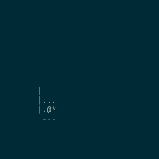
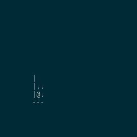

# Rogue-Gym
[](https://travis-ci.org/kngwyu/rogue-gym)
[](https://dev.azure.com/kngwyu/Rogue-Gym/_build/latest?definitionId=1&branchName=master)
[](https://badge.fury.io/py/rogue-gym)

A highly customizable roguelike game, with APIs for training AI agents.

Now [the paper of Rogue-Gym](https://arxiv.org/abs/1904.08129) is on arxiv.

We also published [the traning code](https://github.com/kngwyu/rogue-gym-agents-cog19)
used for the paper.

# Play as human

```
git clone https://github.com/kngwyu/rogue-gym.git
cd rogue-gym/devui
cargo run --release
```

# Watch learned AI

## Double DQN


There's also the action history file, and you can watch it by

```bash
cargo install --path ./devui --force
cd data/learned/ddqn-minidungeon/
rogue_gym_devui --config config.json replay --file best-actions.json --interval 100
```

## PPO + IMPALA ResNet
Code is at https://github.com/kngwyu/rogue-gym-agents-cog19



# Python API

See [this page](./python/README.md)

# Acknowledgements
[rogue5.4](https://github.com/kngwyu/rogue5.4.4)

# Required minimum version of rust
- core/devui 1.31.0-beta
- python 1.32.0 nightly

# License

This project itself is licensed under either of

 * Apache License, Version 2.0, ([LICENSE-APACHE](LICENSE-APACHE) or
   http://www.apache.org/licenses/LICENSE-2.0)
 * MIT license ([LICENSE-MIT](LICENSE-MIT) or
   http://opensource.org/licenses/MIT)

at your option.

This project contains some third party products.

The following third party products are included, and carry their
own copyright notices and license terms:


- [Ubuntu mono font](./data/fonts/UbuntuMono-R.ttf) is distributed
under [UBUNTU FONT LICENCE](./data/fonts/LICENCE.txt)
